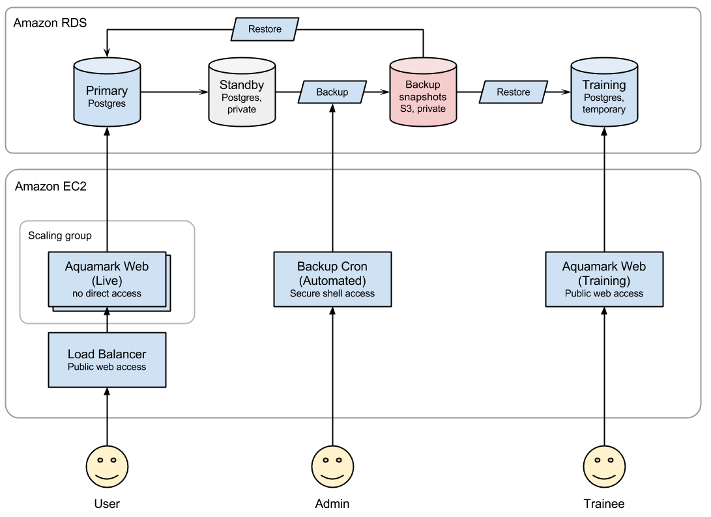

## Long-term Backup Script

Amazon Web Serivces (AWS) has its own managed database instance types known as RDS.
RDS has a default backup system. By default, 7 days of full backup everyday is kept. During those 7 days, it's easy to restore to any point in time using its Point-in-time recovery tool. The setting can be changed up to 35 days. But keep in mind if there is more space needed than the default storage it will be **charged** based on their [pricing policy].

This document describes how to set up a backup solution that lasts for longer
than RDS' maximum 35 days. This directory contains a script that should be run
as a separate Docker container.

Do not deploy this script on the main web instance. Because the web instance
has more open ports and runs our own custom code, it is more vulnerable to
security holes. This script has privilleged access to the RDS backup system, so
it should be run on a more secure machine - preferrably its own instance with
not much else running.

## System diagram



## Backup Cron Job

These are the steps of create job on web instance.

1. Create EC2 instance on AWS. A nano instance should be big enough.
1. Build the backup Docker image from this directory:

    ```
    sudo docker build -t vpac/aquamark-db .
    ```

1. Configure it with your [access key][ac] for the `aq-backup` user:

    ```
    mkdir -p ~/aq_conf
    cp aq_backup_config ~/aq_conf/
    nano ~/aq_conf/aq_backup_config
    ```

1. Run the Docker container:

    ```
    sudo docker run -d --name backup \
        --restart=always \
        --env-file=${HOME}/aq_conf/aq_backup_config \
        vpac/aquamark-db
    ```


[ac]: ../doc/aws_credentials.md


## Restoring from Backup

In the event that the database is corrupted or erased, one of the backups should
be restored. To do that:

1. Go to the [AWS RDS console].
1. Shut down the current instance.
    1. Choose Instances on the left.
    1. Right-click on the `postgres` instance and choose *Delete*. Confirm.
1. Start a new instance with the same name.
    1. Choose *Snapshots* on the left.
    1. Select a snapshot.
    1. Click *Restore snapshot*.
    1. Give the new instance the same *DB Instance Identifier* - `postgres`.
    1. Set *Publicly accessible* to `No`.

Since the new instance has the same name, you don't need to reconfigure the web
services. However, if you have restored to a snapshot that was taken before the
last database scema upgrade, you will need to restart at least one of the web
servers to trigger a fresh schema upgrade (alembic).


## Downloading Backups

The backups stored in RDS are not accessible for download. To get a copy of a
backup, you need to:

1. Create an EC2 instance that has Docker installed on it, in the same AZ and
   local network as the RDS server.
1. SSH to the instance.
1. Create a directory to write to, start a Postgres docker container, and run
   [`pg_dump`].

    ```bash
    mkdir -p ~/backup
    sudo docker run --rm -it -v ~/backup:/backup postgres:9 bash

    # Now in the container
    ENDPOINT=postgres.aiojafojipawefoij.ap-southeast-2.rds.amazonaws.com:5432
    CONN=postgresql://postgres@$ENDPOINT/postgres
    pg_dump --format custom --blobs --verbose ${CONN} --file /backup/aq_dump
    ```

1. Disconnect from the container and the EC2 instance, and then copy the file to
    your local computer.

    ```bash
    mkdir backup
    scp -i aquamark.pem ubuntu@<EC2 INSTANCE>:backup/aq_dump backup/
    ```

Once downloaded, backups can be loaded into a local Postgres/Docker container;
see [Database Backups][backup] for details.


## Files Stored in S3

AWS S3 stores files attached on responses. And also S3 has
[versioning functionality] on bucket. Enable versioning is not reverasable so
once it enabled only suspension versionning is possible. But if we give all
the permission to the user, that user could suspend versioning and then delete
a file. So a special policy is created that does not allow the
`s3:SetBucketVersioning` permission. See [AWS Credentials][ac] for
details.


[AWS RDS console]: https://ap-southeast-2.console.aws.amazon.com/rds/home
[pricing policy]: http://aws.amazon.com/rds/pricing/
[deployment key]: https://github.com/blog/2024-read-only-deploy-keys
[AWS help]: https://console.aws.amazon.com/iam/home?nc2=h_m_sc#security_credential
[`pg_dump`]: http://www.postgresql.org/docs/9.4/static/app-pgdump.html
[`pg_restore`]: http://www.postgresql.org/docs/9.4/static/app-pgrestore.html
[Use SSL]: http://docs.aws.amazon.com/AmazonRDS/latest/UserGuide/UsingWithRDS.SSL.html
[cron job]: cron_backup
[versioning functionality]: http://docs.aws.amazon.com/AmazonS3/latest/dev/Versioning.html
[backup]: ../doc/backup.md
